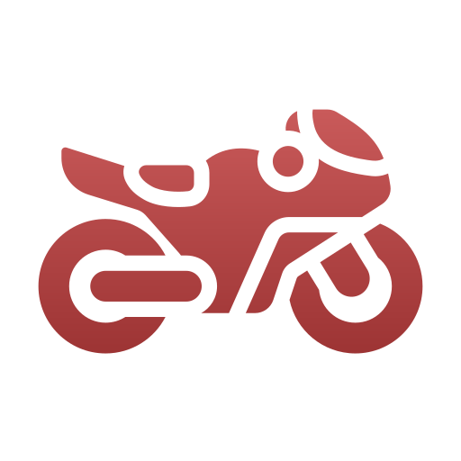

# 🏁 Análisis motogpero 🏍️

    &nbsp;&nbsp;&nbsp;    

### Autor: ESTEVO ARIAS GARCÍA
 

        <h1 style="text-align: center; color: #2E86C1;">¡Bienvenido a nuestra aplicación!</h1>
        <h2 style="margin-top: 20px; color: #117A65;">Podrá usted consultar:</h2>
        <ul style="list-style-type: square; line-height: 1.8; margin-left: 20px;">
            <li><b>LIMPIEZA:</b> <i>El pre-procesamiento de los datasets que utilizamos.</i></li>
            <li><b>EDA:</b> <i>Gráficas comentadas de nuestros análisis exploratorios.</i></li>
            <li><b>TEMPORADAS:</b> <i>Analizamos algunas temporadas y sacamos conclusiones inéditas.</i></li>
            <li><b>CONTRASTE DE HIPÓTESIS:</b> <i>Resolvemos algunas dudas que muchos aficionados al motociclismo tienen/tenemos.</i></li>
            <li><b>MODELO DE REGRESIÓN:</b> <i>Con nuestro nuevo modelo, podrá usted introducir los datos de su circuito (real o ficticio) y éste le dirá el tiempo por vuelta estimado.</i></li>
            <li><b>Sidebar:</b> <i>Información más pormenorizada de todos estos procesos.</i></li>
            <li><b>Y mucho más:</b> <i>¡Esto se actualiza cada día!</i></li>
        </ul>
        <h2 style="margin-top: 30px; color: #117A65;">Próximas novedades:</h2>
        
En pocas semanas, estará disponible la nueva aplicación con la red neuronal <b>InceptionV3</b>, con la que podrá 
        <i>dibujar con el cursor un TRAZADO de un circuito real</i>, y ésta le dirá el nombre del circuito con sus datos y estadísticas.

    

## Ver proyecto en Streamlit: https://motociclismoproyectofinal3232.streamlit.app/
